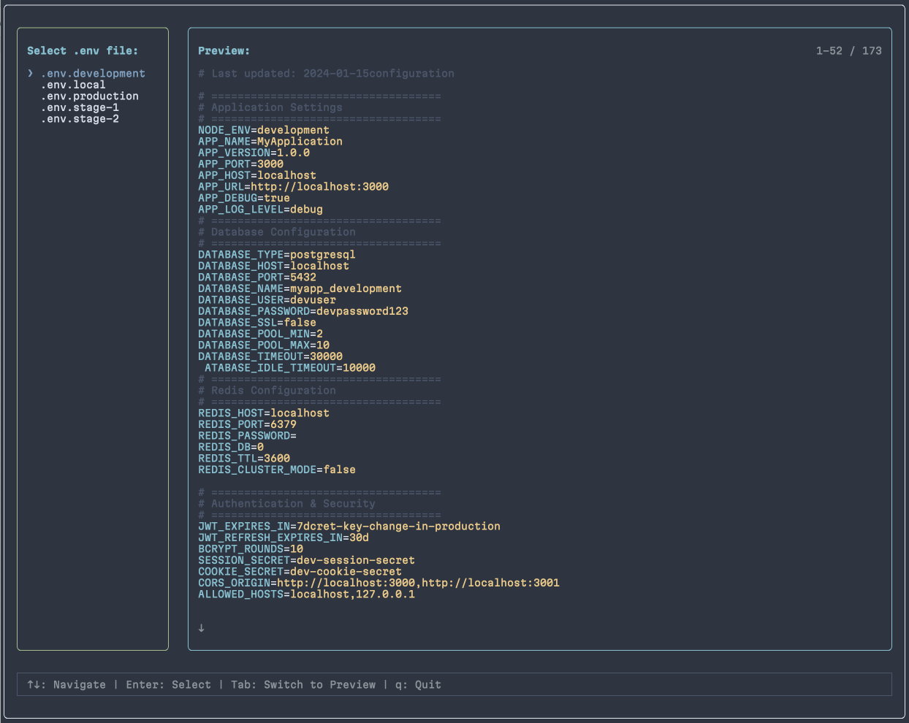

# lazyenv

TUI утилита для быстрого переключения между .env файлами и запуска команд.

## Возможности

- 🔍 Автоматическое сканирование всех `.env.*` файлов в текущей директории
- 🎨 Интерактивный TUI интерфейс на основе Ink
- 📋 Двухпанельный интерфейс с предпросмотром содержимого .env файлов
- 🎯 Модальное окно для выбора команд (в стиле LazyDocker)
- 🚀 Автоматическое копирование выбранного `.env.*` файла в `.env`
- ⌨️ Выбор команды для запуска из scripts в package.json
- 🖥️ Полноэкранный режим с использованием alternate screen buffer

## 📸 Превью



## Установка

```bash
npm install -g @exdeniz/lazyenv
```

Или с помощью npx (без установки):

```bash
npx @exdeniz/lazyenv
```

## Использование

Просто запустите команду в корне вашего проекта:

```bash
lazyenv
```

Или с помощью npx:

```bash
npx @exdeniz/lazyenv
```

### Управление

- `↑↓` - Навигация по списку файлов или прокрутка предпросмотра
- `Tab` - Переключение между панелями (список файлов ↔ предпросмотр)
- `Enter` - Выбор .env файла и открытие модального окна с командами
- `Esc` - Закрыть модальное окно
- `q` - Выход из приложения

## Как это работает

1. Утилита сканирует текущую директорию на наличие `.env.*` файлов
2. Показывает интерактивный список найденных файлов с предпросмотром
3. После выбора файла (Enter) копирует его в `.env`
4. Читает скрипты из `package.json` вашего проекта
5. Если скриптов несколько - показывает модальное окно для выбора команды
6. Запускает выбранную команду с новыми переменными окружения

## Команды

Утилита автоматически читает все скрипты из `scripts` секции вашего `package.json` и предлагает их для запуска после выбора `.env` файла.

Пример `package.json`:

```json
{
  "scripts": {
    "dev": "next dev",
    "build": "next build",
    "test": "jest",
    "start": "next start"
  }
}
```

Все эти команды будут доступны для выбора в модальном окне.

## Структура .env файлов

Утилита ищет файлы с паттерном `.env.*`, например:

- `.env.local`
- `.env.development`
- `.env.stage-1`
- `.env.stage-2`
- `.env.production`

## Разработка

### Установка зависимостей

```bash
bun install
```

### Запуск в режиме разработки

```bash
bun run dev
```

### Сборка

```bash
bun run build
```

### Линтинг

Проект использует [oxc-project](https://oxc.rs/) для линтинга:

```bash
bun run lint
```

## Требования

- Node.js >= 18

## Лицензия

MIT
